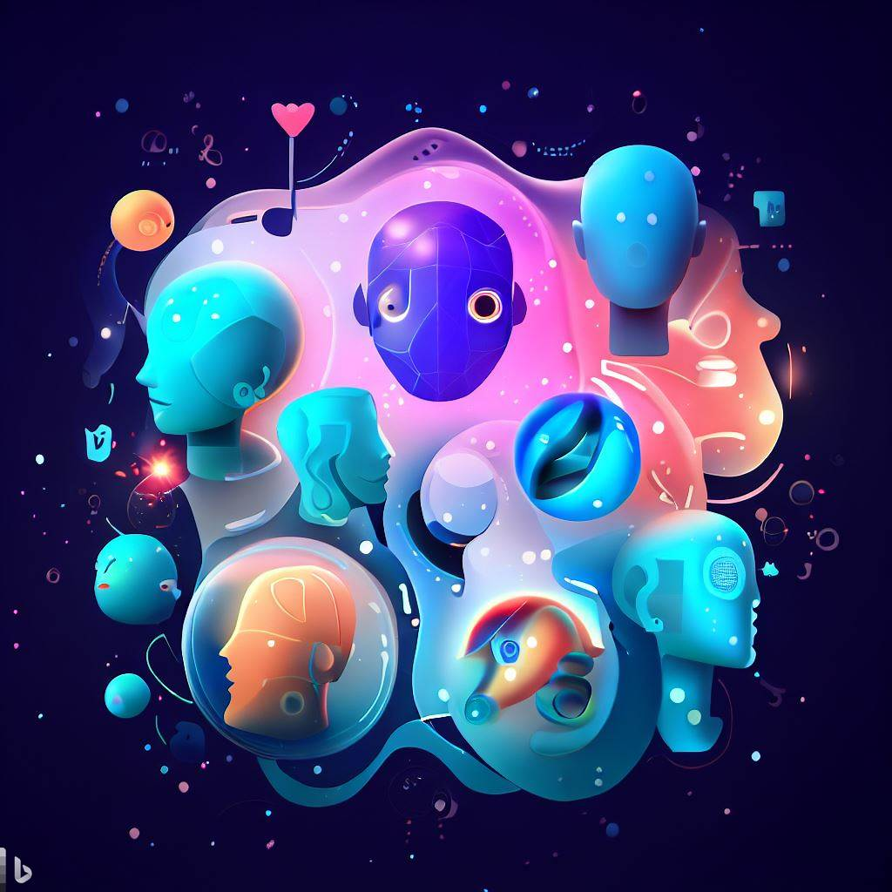

# AIdentities Project

Welcome to the AIdentities Project GitHub repository! This project aims to create an innovative and versatile application that focuses on the development and management of AI-generated identities. Your contribution to this project will help us push the boundaries of AI technology and create a product that is both useful and exciting for users.

*temporary Image generated by Bing Image Creator*

# Goal

The goal of this project is to create a modular application that allows users, thinkers, builders, to build on top of that and extend the capability of the application to achieve whatever we want.

Imagination is the limit, AI is exponentially growing and every day lot of new papers are released, that push the boundaries further.

Proprietary and open source implementations are working recklessly and we can already build on top of them on our local pc.

I firmly believe that LLM models (and every kind of AI model can make use of our personal information) should be hosted on our own hardware, our private information should be confined next to us and not into some big corporation server. There are still cases when a remote model makes sense of course!

I'm not here to enforce anyone on my view, I'm instead trying to create something useful that people can use as they wish, this is why I wanted to invest time in designing a modular application that's more than some scripts glued together but a whole framework that developers can use to augment the software feature set that every one can use. *

###### *(Don't get me wrong, I'm a huge fan of those popular repositories that let you hack into the generative AI world and get your hand dirty, without them even this project probably would not have started, but usability and user experience aren't exactly their priority)

# Current Status

> **Note**  
> The project is currently in its very early stage, everything is subject to change, join the discord server to help shaping it!

Current implemented features:

- Core application and modular system (WIP)
- AIdentities creation
- Basic Chat Plugin (early stage, doesn't allow yet to interact with LLM, this is the next thing that will be implemented shortly)

# Try it out

This project has been developed by using Visual Studio 2022, it shouldn't be a problem run it on other IDEs, I can't just give support to it by myself.
If you are just interested to try the software and not on the development, You can still run it easily by running it on a docker instance (I suggest to do so in any case because it's always better to run unknown programs on a sandboxed environment...)

The docker file is in the src/AIdentities.UI folder but there is already a docker-compose file here in the root folder and if you are lucky and the port aren't already taken in your environment you can just run

`docker-compose up --build`

and then access the web app to the address https://localhost:5001/
If your system doesn't have the port 5000 available you should edit the docker-compose.override.yml file and edit the port with one available (or you can go deeper and add an environment file and configure it externally, that's the preferred way to deal with this kind of apps).


**Note** You can map the volume of the container path `/app/packages/_storage_/`


At current state of development a proper guide doesn't exists yet, so be patient or help writing one 😊

# Community

Join the discord server to help shaping the software!

### Discord server: https://discord.gg/5KbTuGQseB