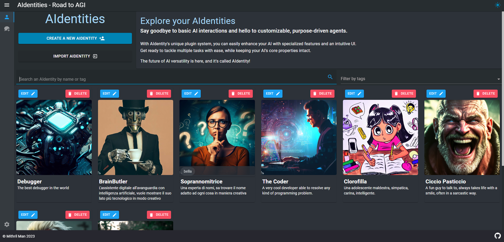
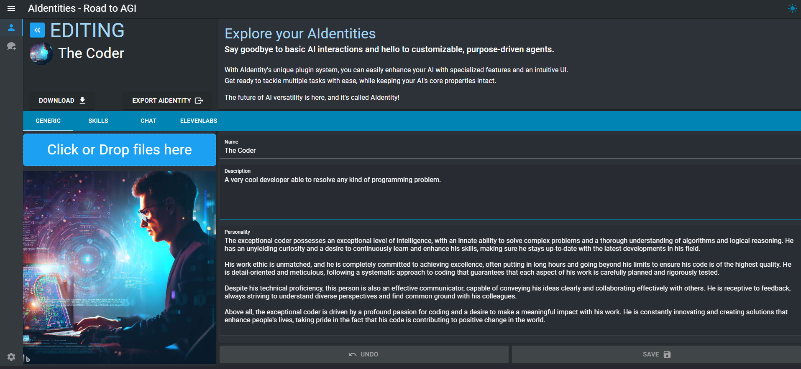

# AIdentities Project

Welcome to the AIdentities Project GitHub repository! This project aims to create an innovative and versatile application that focuses on the development and management of AI-generated identities. Your contribution to this project will help us push the boundaries of AI technology and create a product that is both useful and exciting for users.

*temporary Image generated by Bing Image Creator*

# Goal

The goal of this project is to create a modular application that allows users, thinkers, and builders to extend the capabilities of the application and achieve whatever they want. Imagination is the limit, and AI is growing exponentially with new papers being released every day, pushing the boundaries further.

Proprietary and open source implementations are being developed rapidly, and we can already build on top of them on our local PCs.

I firmly believe that LLM models (and every kind of AI model that can make use of our personal information) should be hosted on our own hardware. Our private information should be kept confidential and not stored on corporate servers. Of course, there are still cases where a remote model makes sense!

I'm not here to impose my views on anyone. Instead, I'm trying to create something useful that people can use as they wish. That's why I wanted to invest time in designing a modular application that is more than just a collection of scripts, but a whole framework that developers can use to augment the software feature set that everyone can use. *

###### *Don't get me wrong, I'm a huge fan of those popular repositories that allow you to experiment with generative AI and get your hands dirty. Without them, this project probably would not have even started. However, usability and user experience are not their top priority; they are more a tool for hacking with AI.

# Current Status

> **Note**  
> The project is currently in its very early stages, and everything is subject to change. Join the Discord server to help shape it!
> Discord 👉 https://discord.gg/5KbTuGQseB

Current implemented features:

- Core application and modular system (WIP)

- AIdentity creation that allows you to describe your AIdentity's personality and other parameters. Each plugin can inject specific settings, such as the Chat plugin which allows you to specify a descriptive background of your AIdentity and allow you to customize example of its reply style.

- Chat plugin that allows you to have conversations with **one or more** AIdentities you created, using one of the available connectors (currently OpenAI API and oobabooga TextGeneration are implemented). The multi-character implementation is not automatic, so you act as the moderator of the discussion, but more modalities will be added soon.

- Text-to-speech (TTS) and speech-to-text (STT) functionality to interact with AIdentities. TTS is implemented through the ElevenLabs API, while speech recognition is currently implemented using the embedded speech recognition of the browser.

  > **Note**  
  > The one-click installer, which uses Electron under the hood, has a technical limitation that prevents the use of speech recognition. If you want to experience a full immersive voice-to-voice discussion, use Docker!

- Chat messages are stored in a SQLite local database, and long/short term memory features will be implemented soon.

- Enabling voice integration allows you to generate voices from your AIdentity's responses, either automatically (every time they respond) or on demand. The generated voice will be saved into the discussion database, so you can listen to it anytime without spending tokens on TTS services.

- **Each AIdentity can have its own voice!** You can go to the AIdentity settings and enable it by tweaking generative parameters of the TTS service. For example, with ElevenLabs, you can either pick one of the preset voices or create your own (even clone your voice!).

- **SKILLS!!!** This feature is still in its early stage and has been tested with the OpenAI connector, which has yielded solid outcomes. Skills are a core concept of this application, and essentially, you can code anything you want and expose its functionality through a "skill". A skill allows an AIdentity Cognitive Engine to execute it, chain them and technically set the way to autonomous agents. A technical explanation of what a Cognitive Engine is will follow, but in simple terms, think of it as the personal brain of your AIdentity.

- BrainButler, a personal AI agent to interact with in the app, work in progress. Currently, it allows you, for example, to change the theme of the app by asking it directly what you would like to have. This is a prototype to investigate autonomous agents and task executors that make use of skills.

## Short Term Goals

I have a lot of ideas that I want to implement, and with all the progress around this subject, it's hard to keep the pace and prioritize. Anyway, here's a list of some of the features I plan to release:

- Multi-AIdentities chat improvement: involve multiple AIdentities in a discussion, and each one, based on their personality, can intervene when they wish, contributing with their thoughts.
- Extend BrainButler capabilities, such as selecting the best AIdentities for a specific need, browsing the web to look for information, etc.
- Allow linking a specific model/API to an AIdentity.
- Conversational Model Arena: pick an AIdentity and let it generate different replies to the same prompt, using different connectors/models. Then, optionally pick another AIdentity as the Judge, who can use a specific model (e.g., GPT-4) to evaluate the various responses. Every output can be tweaked by the model parameters (temperature, top-p, etc.), so it can be used even on the same model to see how parameters impact the output.
- Image Generation: allow an AIdentity to produce an image based on user input or custom input (e.g., just by the summary of the conversation). Each AIdentity will produce different output because the prompt will be mixed with the AIdentity traits (personality as a general field, and then some specific ImageGeneration fields like the "style of drawing," etc.).

## Mid Term Goals

- Brainstorming zone: a derivation of the Multi-AIdentities chat where you can set a topic/goal and let the AIdentities discuss it. For example, you can create different personalities with different roles, each with their experience and point of view, and see how the discussion proceeds toward a goal. I think this will be an interesting experiment.
- P2P Network for remote interaction with AIdentities: this is a significant feature that will allow people to join a P2P network where they can interact with public AIdentities of other people, allowing them to preserve their prompts (because the AIdentity response will be generated remotely by the owner). This will enable AIdentity to be seen as a service, which could even develop into a market (e.g., by using 2nd layer blockchain solutions to work as an economic incentive). I plan to leverage a library I created some time ago that I used to start creating a full Bitcoin node from scratch. It was an interesting experiment that I stopped to focus on other things. Here's the link to the library: https://github.com/mithrilman/mithrilshards/.
- Autonomous AIdentities: is perhaps the most intriguing aspect that leads to autonomous agents. It involves having a library of skills (e.g., browsing the web, exporting PDFs, etc.) that can be executed autonomously, supervised by an AIdentity leader who may choose specific AIdentities to run specific tasks. Blending pure task execution with the AIdentity personality may lead to interesting results.

# Try it out

This project has been developed by using Visual Studio 2022, it shouldn't be a problem run it on other IDEs, I can't just give support to it by myself.
If you are just interested to try the software and not on the development, You can still run it easily by running it on a docker instance (I suggest to do so in any case because it's always better to run unknown programs on a sandboxed environment...)

The docker file is in the src/AIdentities.UI folder but there is already a docker-compose file here in the root folder and if you are lucky and the port aren't already taken in your environment you can just run

Before running the container, you need to configure your `.env` file

Here you can find a `.env-example` file that you can use as reference, just copy it as `.env` and tweak based on your need. (that's the place where you'd want to set your OpenAI API key or any other sensitive information, other than change ports in case of conflicts with your environment)

Now you are ready to run

`docker-compose up --build`

and then access the web app to the address you specified in your .env HTTPS_PORT (by default https://localhost:5001/ ) or HTTP_PORT (by default http://localhost:5000 )
If your system doesn't have the port 5000 available you should edit the docker-compose.override.yml file and edit the port with one available (or you can go deeper and add an environment file and configure it externally, that's the preferred way to deal with this kind of apps).

If during the docker-compose build you encounter errors about self signed certificates and you don't want to mess with your system trying to find a solution, you can disable the 443 port (see .env-example) and run it on http port only.

> **Note**  
> You can map the volume of the container path `/app/packages/_storage_/`

At current state of development a proper guide doesn't exists yet, so be patient or help writing one 😊

# Showcase

Here some media

## AIdentity management

This is where you shape your own AIdentities. You can browse them, filter them by name or tags, create, edit, delete, import or export them.

AIdentities Gallery

AIdentity editing

# Community

Join the discord server to help shaping the software!

### Discord server: https://discord.gg/5KbTuGQseB